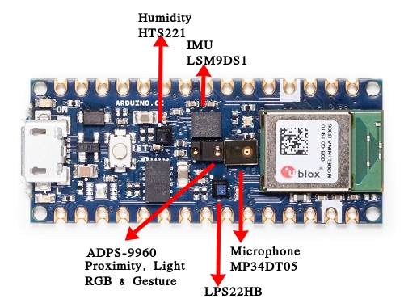
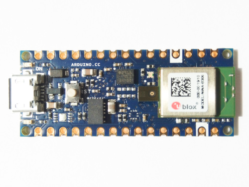
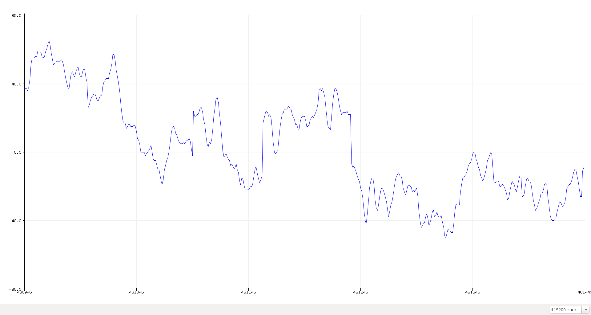
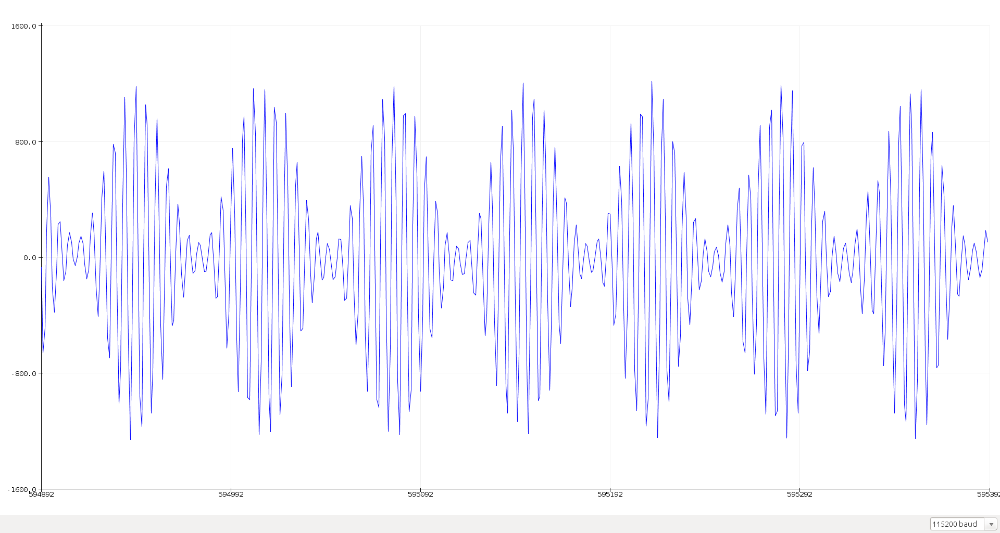

## Audio Experiments
### **SETUP**

| Nano 33 BLE | Nano 33 BLE Sense |
| :---: | :---: |
|  |  |

To save _setup costs_ often boards that are efectively the same have exactly the same schematics and layout even though one may lack certain ICs. That is exactly the case with Nano 33 BLE and Nano 33 BLE Sense. _That's why you have unpopulated places on the Nano 33 BLE_!  
Since I have Nano 33 BLE, all I need to do is get the relevant ICs and solder them at their respective places and I have something in between Nano 33 BLE and Nano 33 BLE Sense !  
I am especially interested in Audio because of the immense potential with audio based applications with the DSP core of the ARM Cortex M4 especially the Artificial Intelligence and Machine Learning capabilities like running Tensorflow Lite !  
I got STMicroelectronics to send me some free samples of their MP34DT05 microphone to solder on my board.
This is what I ended up with -  

| Nano 33 BLE with Microphone | Nano 33 BLE |
| :---: | :---: |
|  |  |

### **Testing the Microphone**
The Microphone outputs audio in PDM format so we can use the Example Sketch that comes inbuilt **PDMSerialPlotter** from `File->Examples->PDM->PDMSerialPlotter`.
I used the _ToneGenerator_ android app to generate various waves at varying frequencies to check the output waveforms on the plotter.  
Outputs - 

### On a sidenote
Where is the _PDM Library_ located? Where are its files?  

(Answer taken verbatim from a reply)  
Here's how you can easily find it where it it is installed on your computer:

1. Tools > Board > Arduino Nano 33 BLE
2. File > Examples > PDM > PDMSerialPlotter
3. Sketch > Show Sketch Folder

This will open the PDM/examples/PDMSerialPlotter folder. You will find the source files of the library under PDM/src

The same technique can be used to find the location of any library you have installed.

Be aware that the libraries bundled with hardware cores are only accessible when a board of that core is selected. Each hardware core comes bundles with it's own architecture-specific version of the standard libraries like SPI and Wire. So you will have multiple versions of these libraries installed on your computer and the one that will be accessed depends on the Tools > Board menu selection at the time.

#### More Audio Experiments
- Integrating Serial with Processing to perform interesting transforms.
- Getting the ArduinoSound Library to work - FFTs and other things.
- Changing the inbuilt parameters of the PDM Library as right now changing anything doesn't work at all.