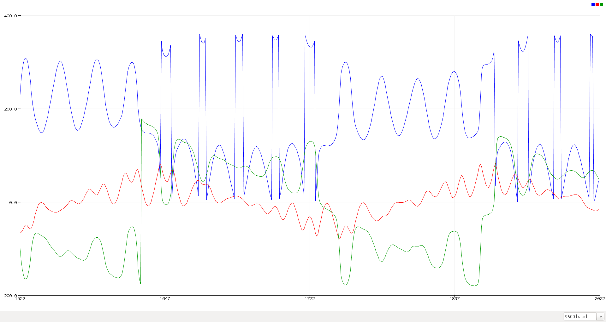
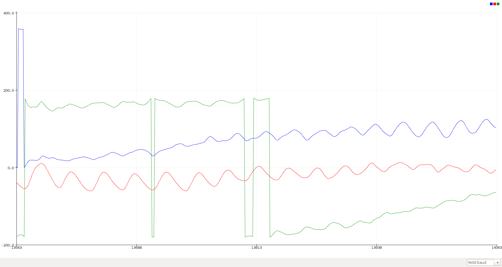
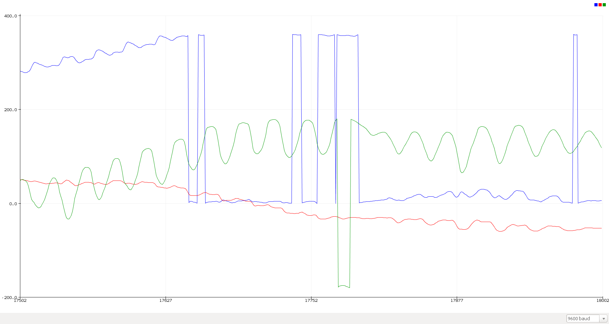
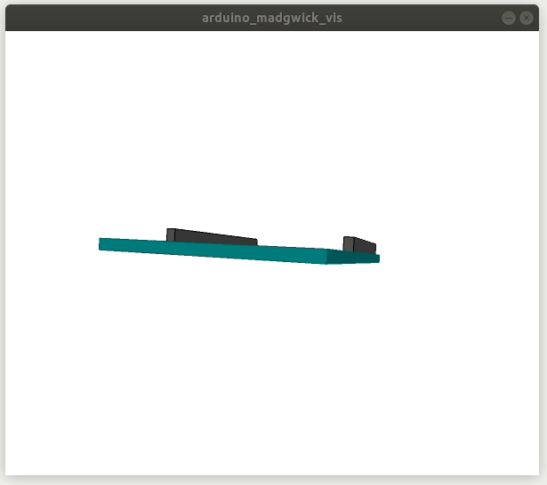

IMU
---

Examples added for Arduino Madgwick Library, PJRC Madgwick and PJRC Mahony Libraries.  

Arduino Madgwick can be installed the usual way.

For PJRC Madgwick and Mahony, source files have been provided and the imports are local.

All examples have a Processing file for visualization.

### Issues
- A lot of drift on Yaw. Small and slow movements seem okay but otherwise its horrible. Maybe its the issue with the mems sensor itself. Its refresh rates are quite slow. Arduinio Library states accelerometer and gyroscope update at 104Hz, however the source file tells a different story - updates there are at 119Hz. Faster updates are possible but I think it hasn't been implemented.
- Values clip and apparently reverse for strong motions. Examples below -

- Drift: Between shaking there are moments where i just hold the board still but thats not what happens. It also starts from a still surface but as you'd notice it has a drift right from the beginning.

- Including or excluding magnetometer readings doesnt seem to affect much if at all.  
- The LSM9DS1 library itself needs limprovisation.