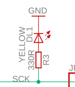
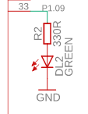
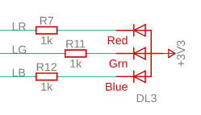

# All things Arduino Nano 33 Bluetooth
{: .fs-9 }

I was able to get the Nano 33 BLE in July as I had preordered it so I got down to play with it.
{: .fs-6 .fw-300 }

[Purchase](https://store.arduino.cc/usa/nano-33-ble){: .btn .btn-primary .fs-5 .mb-4 .mb-md-0 .mr-2 } [ArduinoBLE on GitHub](https://github.com/arduino-libraries/ArduinoBLE){: .btn .fs-5 .mb-4 .mb-md-0 .mr-2} [Reference](https://www.arduino.cc/en/Reference/ArduinoBLE){: .btn .fs-5 .mb-4 .mb-md-0 .mr-2}

---

## **Important Differences**
<strike>The board as displayed on the Website is different than what you actually get. There is actually a RGB LED on board that you don't see in the official image and the official image has an IC that isn't there in the real board.</strike> The initial image of the board on the Arduino page was the one on the left but the board that I got is the one on the right and since then the image has been updated. Notice the RGB LED circled in red.

--- | ---
:-------------------------:|:-------------------------:
  |  

---

## **First things first**
The pins that have been brought out as headers can be addressed just like you'd for say Uno and you can see them in the Tech Specs. It's the pins that haven't been brought out and you may need to control like the RGB pins or the 2 LEDs that might need your attention.  

The [official documents](https://store.arduino.cc/usa/nano-33-ble) are not yet upto speed with Board Definitions. I made the mistake of actually opening the schematics and layout in Autocad Eagle to find out the PIN definitions. But that's incorrect as they may or may not be the same as the internal pin definitions. I even ended up asking this on the [Forum](https://forum.arduino.cc/index.php?topic=630665.0). You can read it to find out how I found the pins _experimentally_ for the RGB LED.  

The answer led me to the repository where the actual **board pin definitions** are written. So this is what you must use to declare pins in your sketches-  

| LED | PIN |
| :---: | :---: |
| PIN_LED | 13u |
| RGB LED RED | 22u |
| RGB LED GREEN | 23u |
| RGB LED BLUE | 24u |
| LED_PWR | 25u |

**Note:** _The 2 general LEDs are connected as usual: when the digital pin they are attached to goes high, they glow. But the RGB LED is wired in the opposite way i.e it's connected to the power rail so you need to drive the pins they are connected with to LOW to turn them ON._

| PIN-13 | POWER | RGB |
| :---: | :---: | :---: |
|  |  |  |

Following are the usual ones(header pins) as mentioned in the Tech Specs.

```cpp
// Analog pins
// -----------
#define PIN_A0 (14u)
#define PIN_A1 (15u)
#define PIN_A2 (16u)
#define PIN_A3 (17u)
#define PIN_A4 (18u)
#define PIN_A5 (19u)
#define PIN_A6 (20u)
#define PIN_A7 (21u)

// Serial (EDBG)
#define PIN_SERIAL_RX (1ul)
#define PIN_SERIAL_TX (0ul)

// SPI
#define PIN_SPI_MISO  (12u)
#define PIN_SPI_MOSI  (11u)
#define PIN_SPI_SCK   (13u)
#define PIN_SPI_SS    (10u)

// Wire
#define PIN_WIRE_SDA        (18u)
#define PIN_WIRE_SCL        (19u)

#define PIN_WIRE_SDA1       (30u)
#define PIN_WIRE_SCL1       (31u)

#define PIN_ENABLE_SENSORS_3V3     (32u)
#define PIN_ENABLE_I2C_PULLUP      (33u)

#define PIN_INT_APDS (26u)

// PDM Interfaces
// ---------------
#define PIN_PDM_PWR	 (27)
#define PIN_PDM_CLK	 (28)
#define PIN_PDM_DIN	 (29)
```
---

### BLE Experiments
Testing the bluetooth connection is simple enough. We will use the inbuilt the Peripheral Examples from [this library](https://github.com/arduino-libraries/ArduinoBLE) that you can install via the [Library manager](https://www.arduino.cc/en/guide/libraries#toc3). You can install the [nRF Connect](https://play.google.com/store/apps/details?id=no.nordicsemi.android.mcp) App for the connection.

#### More custom BLE Experiments

#### TODO
Controlling Led Characteristics using a python script from Desktop/PC.

### Audio Experiments
Nano 33 BLE vs Nano 33 BLE Sense

|  |  |

To save _setup costs_ often boards that are efectively the same have exactly the same schematics and layout even though one may lack certain ICs. That is exactly the case with Nano 33 BLE and Nano 33 BLE Sense.  
Since I have Nano 33 BLE, all I need to do is get the relevant ICs and solder them at their respective places and I have something in between Nano 33 BLE and Nano 33 BLE Sense !  
I am especially interested in Audio because of the immense potential with audio based applications with the DSP core of the ARM Cortex M4 especially the Artificial Intelligence and Machine Learning capabilities like running Tensorflow Lite !  
