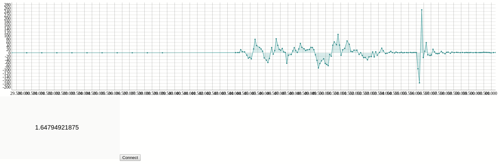
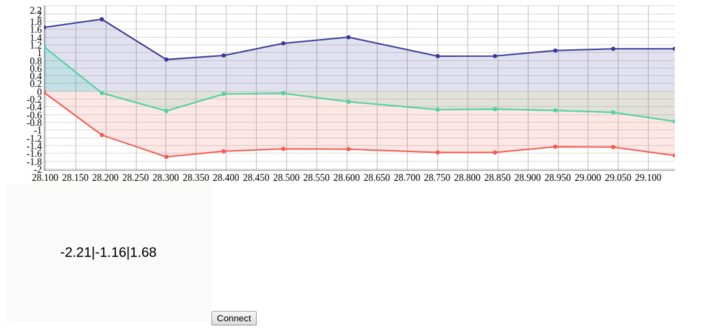
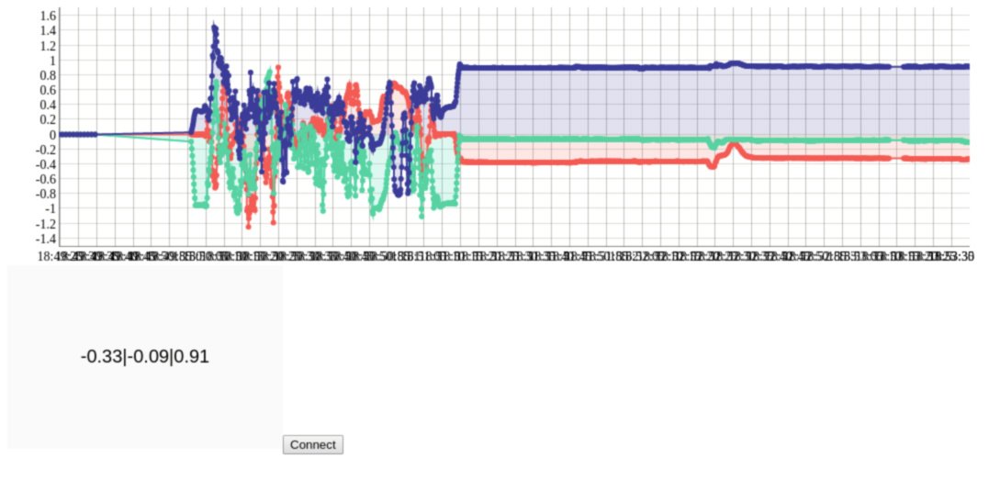

# Quickstart

This is a very simple example using the inbuilt Battery Monitor example. The javascript library used for Web Bluetooth is [p5.ble.js](https://yining1023.github.io/p5ble-website/).  

## Steps to Run

1. Load the `BatteryMonitor` example from ArduinoBLE Library
2. Goto the `bluetooth/web_bluetooth` folder in master and open the html file in Chrome.
3. Connect and watch the value change in the box

# Real Time Accelerometer Data Plotting

For real time plotting I am using the `dygraph.js` library.
Open the index.html page in Chrome and connect to your Arduino Nano 33 BLE and watch the graph update.

* Random Plot

* Data Points shift left

* All data points stay
